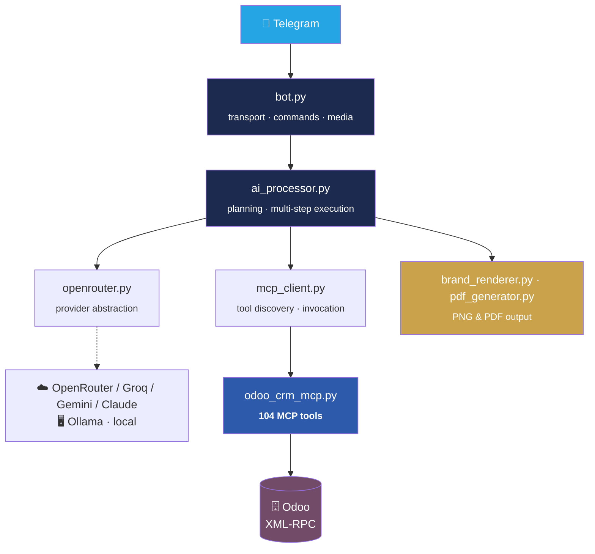

<div align="center">

# 🤖 Odoo AI Telegram Assistant

### Run your entire Odoo ERP from a Telegram chat — in plain language.

[](https://www.python.org/)
[](https://www.odoo.com/)
[](https://modelcontextprotocol.io/)
[](https://core.telegram.org/bots)

**CRM · Sales · Inventory · Accounting · Helpdesk — all driven by natural language**

</div>

---

## ⚡ What it does

Type a sentence. It figures out the sequence of ERP operations and runs them.

> **“Create a lead for Northwind Traders, convert it to an opportunity, quote 10 units of Product A, confirm it and invoice it.”**


No forms. No clicking through menus. One message.

---

## ✨ Features

| | Feature | Detail |
|:--:|---|---|
| 🧰 | **104 Odoo MCP tools** | CRM, Sales, Inventory, Accounting, Helpdesk — leads, quotations, deliveries, invoices, credit notes, reconciliation |
| 🔀 | **5 LLM providers** | OpenRouter · Groq · Gemini · Claude · **Ollama** (fully local) — switch with one env var |
| 🔐 | **Real Odoo permissions** | Each user logs in with their own Odoo credentials; every action runs under their actual access rights and record rules |
| 🛡️ | **Approval-gated admin bot** | Privileged operations route through a separate bot requiring explicit approval |
| 🎨 | **Branded PNG & PDF reports** | Styled output via PIL and ReportLab — colours, typography and signature fully configurable |
| 🌍 | **Multilingual** | Reports and replies generated in the user's language |
| 🧵 | **Conversation memory** | Per-user history, so follow-ups resolve against earlier context |

---

## 🏗️ Architecture



<details>
<summary><b>📁 Module reference</b></summary>

<br>

| Module | Responsibility |
|---|---|
| `bot.py` | Telegram transport, commands, media delivery |
| `ai_processor.py` | Orchestrator — planning and multi-step tool execution |
| `openrouter.py` | Provider abstraction across all five LLM backends |
| `mcp_client.py` | MCP transport — tool discovery and invocation |
| `odoo_crm_mcp.py` | MCP server exposing 104 Odoo tools over XML-RPC |
| `auth_manager.py` | Per-user Odoo authentication |
| `admin_manager.py` | Privileged actions and the approval flow |
| `conversation_store.py` | Per-user conversation history |
| `brand_config.py` | Brand identity — colours, typography, signature |
| `brand_renderer.py` | PIL image rendering engine |
| `pdf_generator.py` | ReportLab PDF report generation |
| `odoo_knowledge_base.py` | Odoo domain context for the model |

</details>

<details>
<summary><b>🧰 Tool coverage</b></summary>

<br>

**CRM** — leads, opportunities, stages, activities, chatter, won/lost handling, lead→SO conversion
**Sales** — quotations, order confirmation, order lines, pricing
**Inventory** — deliveries, validation, stock moves
**Accounting** — invoices, credit notes, payment terms, reconciliation, payment registration
**Helpdesk** — tickets and ticket workflow

</details>

---

## 🚀 Quick start

```bash
git clone https://github.com/prashantk8ursrvc-ux/odoo-ai-telegram-mcp.git
cd odoo-ai-telegram-mcp

python -m venv .venv
source .venv/bin/activate          # Windows: .venv\Scripts\activate

pip install -r requirements.txt
cp .env.example .env               # fill in your own values

python bot.py
```

**Requires** Python 3.10+ and an Odoo instance reachable over XML-RPC.

---

## ⚙️ Configuration

Everything is environment-driven — see [`.env.example`](.env.example).

| Variable group | Purpose |
|---|---|
| `BOT_TOKEN` · `ADMIN_BOT_TOKEN` | Telegram bots — main and admin |
| `LLM_PROVIDER` + provider keys | Which model backend to use |
| `ODOO_URL` · `ODOO_DB` · `ODOO_VERSION` | Target Odoo instance |
| `BRAND_*` | Report branding — neutral defaults, override freely |

<details>
<summary><b>🎨 Rebranding the reports</b></summary>

<br>

Reports ship with neutral placeholder branding. Override any of these to apply your own identity — no code changes needed:

```env
BRAND_COMPANY_NAME=YourCompany
BRAND_COMPANY_SUBTITLE=Ltd.
BRAND_SIGNATURE_NAME=Your Name
BRAND_SIGNATURE_EMAIL=you@example.com
BRAND_COLOR_PRIMARY_NAVY=#1B2A4E
BRAND_COLOR_ACCENT_BLUE=#2E5AAC
```

</details>

---

## 🔒 Security

- `.env`, `user_credentials.json` and `admin_users.json` are gitignored — **never commit them**
- Odoo credentials are per-user; all actions execute under that user's own permissions and record rules
- Privileged operations require approval through the admin bot
- ⚠️ **Before deploying:** review how user credentials are persisted and encrypt them at rest

---

<div align="center">

**Personal project, shared as a working reference for MCP-based ERP automation.**
No warranty — review and adapt before production use.

</div>
